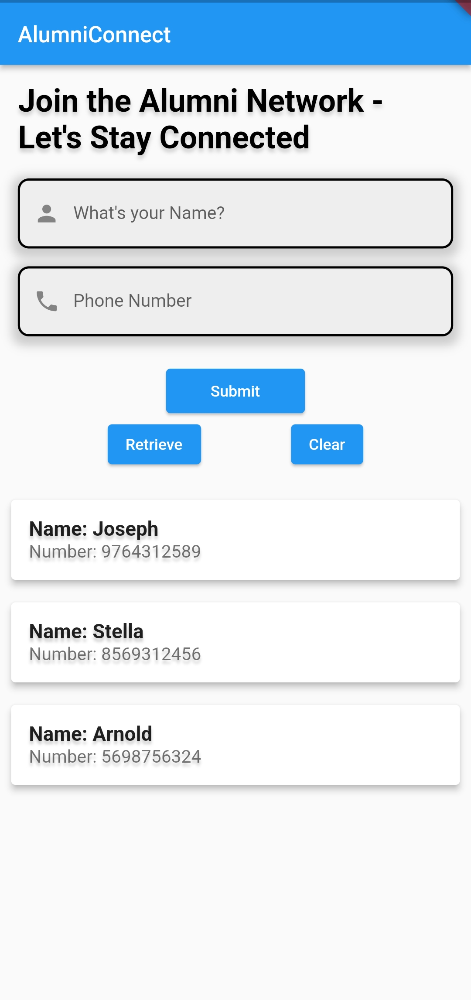

# Flutter Firebase Data Input and Retrieval App

<p align="center">
  <table>
    <tr>
      <td style="padding-right: 20px;">
        
      </td>
      <td>
        
      </td>
    </tr>
  </table>
</p>

## Table of Contents

- [Features](#features)
- [Installation](#installation)
- [Technologies](#technologies)
- [License](#license)
- [Contact Me](#contact-me)

## Features

- User-friendly input form for data entry.
- Real-time retrieval and display of entered data.
- Firebase backend for efficient data storage.
- Responsive design for seamless usage on various devices.
- Clean and well-organized Flutter codebase.
- Easy-to-understand and customizable for your needs.

## Installation

1. Clone this repository.
   ```sh
   git clone https://github.com/HiBorn4/Alumni_Connect
   ```

2. Change directory to your project folder.
   ```sh
   cd Alumni-Connect
   ```

3. Install the required dependencies.
   ```sh
   flutter pub get
   ```

4. Set up Firebase for your project:
   - Create a Firebase project on the [Firebase Console](https://console.firebase.google.com/).
   - Generate and download your `google-services.json` file.
   - Place the `google-services.json` file in the `android/app` directory.

5. Run your app:
   ```sh
   flutter run
   ```

## Technologies

- [Flutter](https://flutter.dev/): Google's UI toolkit for building natively compiled applications.
- [Firebase](https://firebase.google.com/): Google's mobile and web application development platform.

## License

Distributed under the MIT License. See [LICENSE](LICENSE) for more information.

## Contact Me

- Email: hiborn4@gmail.com
- LinkedIn: [Aryan Shirke](https://www.linkedin.com/in/aryan-shirke/)
- GitHub: [HiBorn](https://github.com/HiBorn4)
